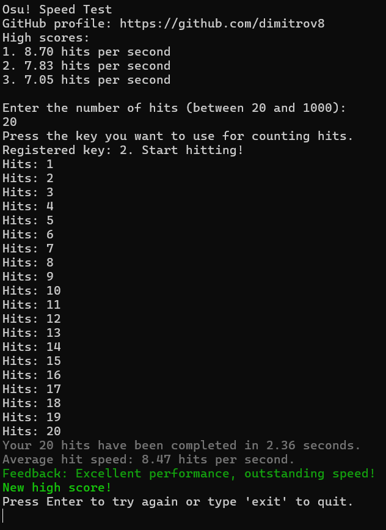

# Osu! Speed Test

## 🎯 Overview
Console application for measuring and tracking clicking performance metrics, designed for Osu! players and speed test enthusiasts.



## ✨ Key Features

### ⚡ Performance Metrics
- Real-time hits-per-second (HPS) measurement
- Historical high score tracking
- Performance benchmarking

### 🖥️ Interface
- Clean console-based UI
- Intuitive keyboard controls
- Instant feedback visualization

## 📥 Installation Options

### Option A: Pre-Built Executable
1. Download the latest release from [Releases](https://github.com/dimitrov8/OsuSpeedTest/releases)
2. Run `OsuSpeedTest.exe`

### Option B: Source Compilation
```bash
git clone https://github.com/dimitrov8/OsuSpeedTest.git
cd OsuSpeedTest
dotnet build --configuration Release
```

## ⚠️ Security Notice
Windows SmartScreen may initially block execution. This is standard for new applications without established reputation. Recommended options:

1. **Quick Start**:  
   `More Info` → `Run anyway`  
   *(Safe if downloading from official releases)*

2. **Full Verification**:  
   Compile from source after reviewing code

## 🤝 Contributing & Support

### Reporting Issues
Please include:
- Windows version
- Exact error message
- Steps to reproduce
- Expected vs actual behavior

[Open an Issue](https://github.com/dimitrov8/OsuSpeedTest/issues)
