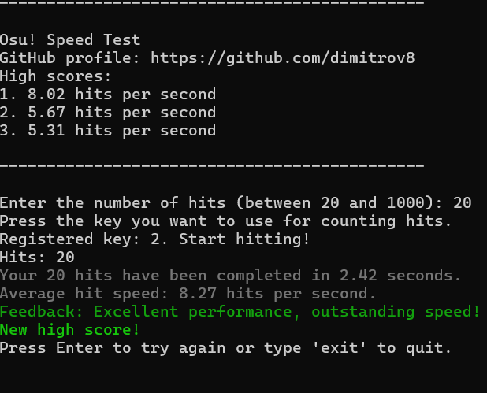

# Osu! Speed Test

## Description

"Osu! Speed Test" is a console application designed for Osu! players and anyone interested in measuring and tracking their clicking speed and performance metrics.

## Features

- **Speed Test:** Measure your hits per second (HPS) in a simulated test environment. Track how fast you can click within a given time frame.

- **Performance Tracking:** Save and display the highest hits per second achieved. Monitor your progress over time to see improvements in your clicking speed.

- **User-Friendly Command-Line Interface:** Enjoy a straightforward interface suitable for all skill levels. Simply follow the on-screen instructions to perform a speed test.

## Download and Installation

To use "Osu Speed Test," download the latest release executable from the [Releases](https://github.com/dimitrov8/OsuSpeedTest/releases) page.

## Compiling from Source

If you prefer to compile the application from the source code:

1. Clone the repository: `git clone https://github.com/dimitrov8/OsuSpeedTest.git`
2. Navigate into the cloned directory: `cd OsuSpeedTest`
3. Build the application using your preferred development environment.

## SmartScreen Warning

When running "Osu! Speed Test" on Windows, you may encounter a SmartScreen warning indicating that the application is unrecognized. This is because SmartScreen does not have enough data about the application's reputation yet. You can click on <ins>More Info</ins> and then choose the **Run anyway** option.

If you are concerned about the SmartScreen warning, you have the option to compile the application from the source code yourself. This way, you can verify the integrity of the code before running it.

## Usage

1. Run the executable file `OsuSpeedTest.exe`.
2. Follow the on-screen instructions to perform a speed test.
3. View high scores and receive feedback based on your performance.

## Having Issues?

Feel free to [open an issue](https://github.com/dimitrov8/OsuSpeedTest/issues) on GitHub if you run into any problems with "Osu! Speed Test." Please include details and any error messages.
